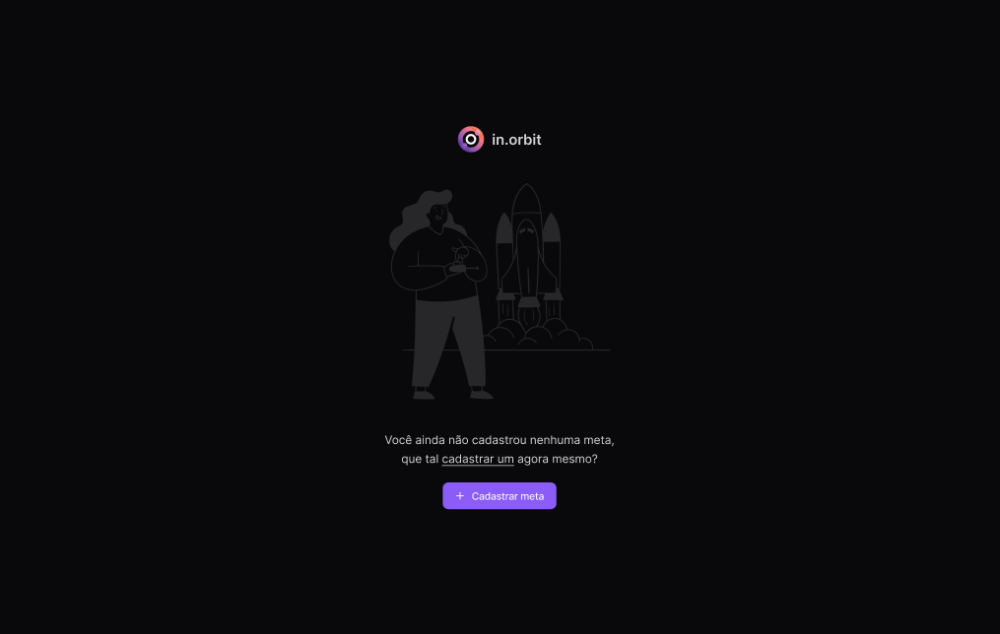
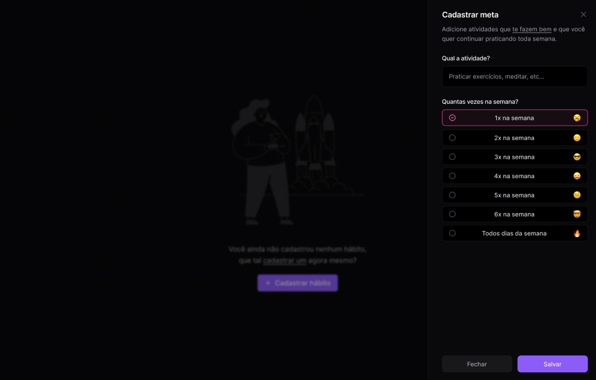
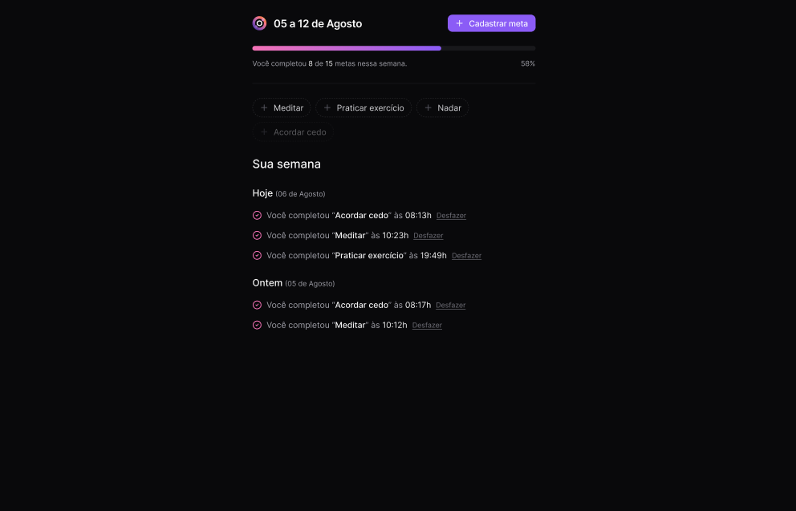

<h1 align="center"> NLW Pocket</h1>

Evento exclusivo e gratuito, promovido pela Rocketseat para ensino de tecnologias WEB.

  <a href="#-tecnologias">Tecnologias</a>&nbsp;&nbsp;&nbsp;|&nbsp;&nbsp;&nbsp;
  <a href="#-projeto">Projeto</a>&nbsp;&nbsp;&nbsp;|&nbsp;&nbsp;&nbsp;
  <a href="#-layout">Layout</a>&nbsp;&nbsp;&nbsp;|&nbsp;&nbsp;&nbsp;
  <a href="#-Inicializaçao">Inicializaçao</a>&nbsp;&nbsp;&nbsp;|&nbsp;&nbsp;&nbsp;
  <a href="#-Telas">Telas</a>&nbsp;&nbsp;&nbsp;|&nbsp;&nbsp;&nbsp;

 

## 🚀 Tecnologias

Esse projeto foi desenvolvido com as seguintes tecnologias:

- HTML e CSS
- JavaScript
- [Vite](https://vitejs.dev/)
- [React](https://react.dev/)
- [Tailwind](https://tailwindcss.com/)
- [Zod](https://zod.dev/)
- [Postgres](https://www.postgresql.org/)
- [Drizzle-orm](https://orm.drizzle.team/)
- [Fastify](https://fastify.dev/)
- [Biomejs](https://biomejs.dev/pt-br/)
- [Docker](https://www.docker.com/)
- [Node e NPM](https://nodejs.org/)

## 💻 Projeto

O In.Orbit é uma aplicação para o cadastro e registro de metas saudaveis; para praticar e completar durante suas semanas

## 🔖 Layout

Você pode visualizar o layout do projeto através [DESSE LINK](https://www.figma.com/design/neyUc0d32z6GSwuHeXvwm4/NLW-Pocket-JS-%E2%80%A2-in.orbit-(Community)?node-id=82-2&t=nTgY5jFQkwk1EyUO-1). É necessário ter conta no [Figma](https://figma.com) para acessá-lo.

 ## Inicializaçao 
 Para inicializar o projeto utilizar Docker para o banco de dados Postegres; installar dependencias em server e web NPM i pelo terminal; NPM RUN DEV em ambos para dar laucher na aplicação  

 ## Telas da aplicação 
  

  

  

  

